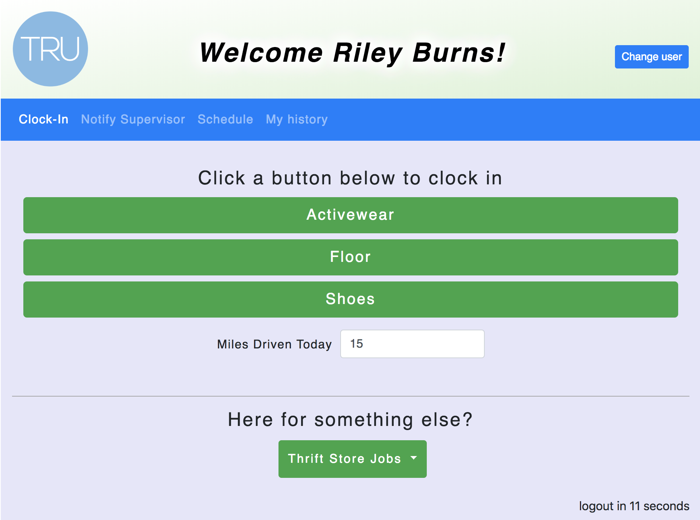
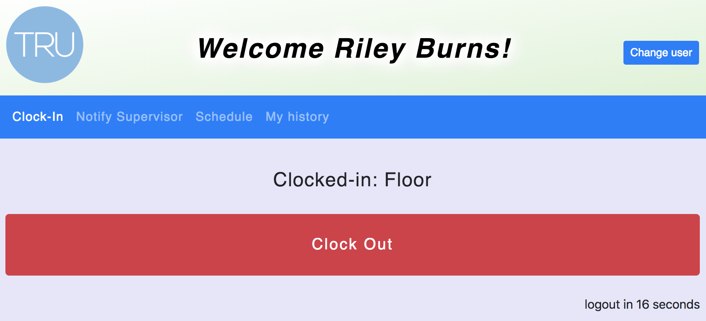
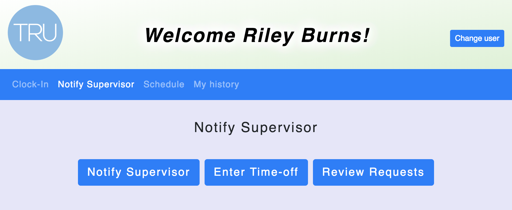
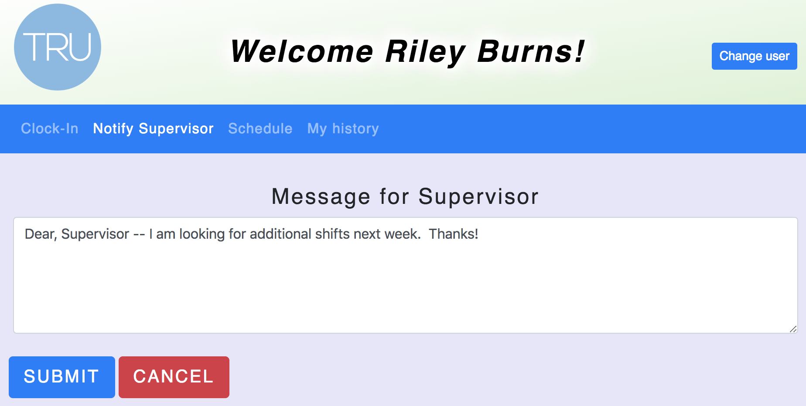
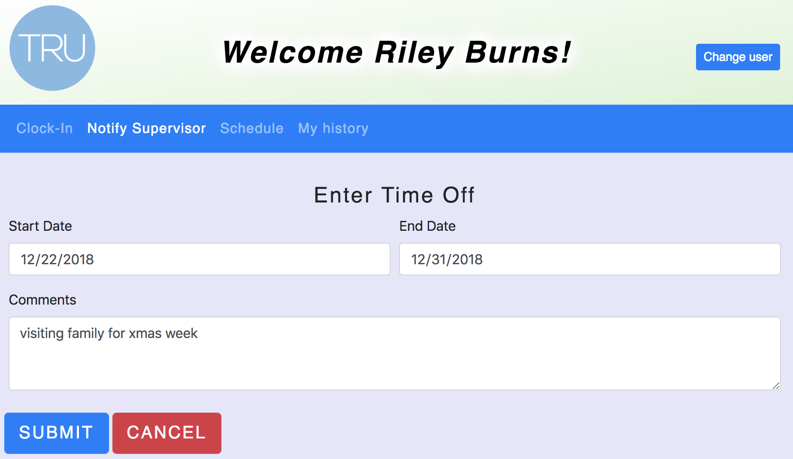
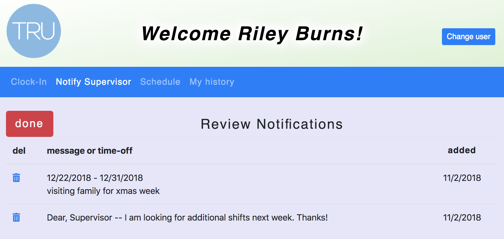
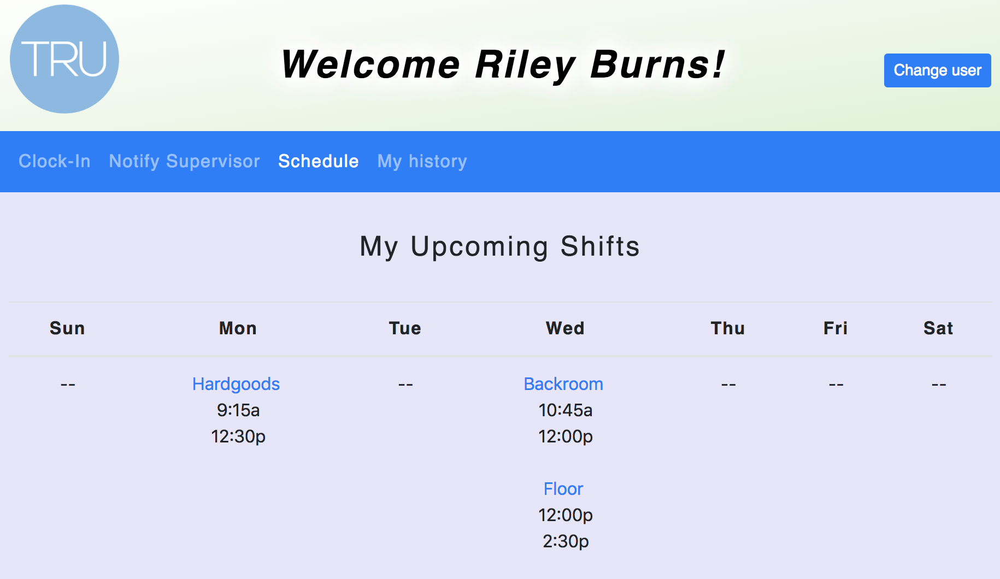
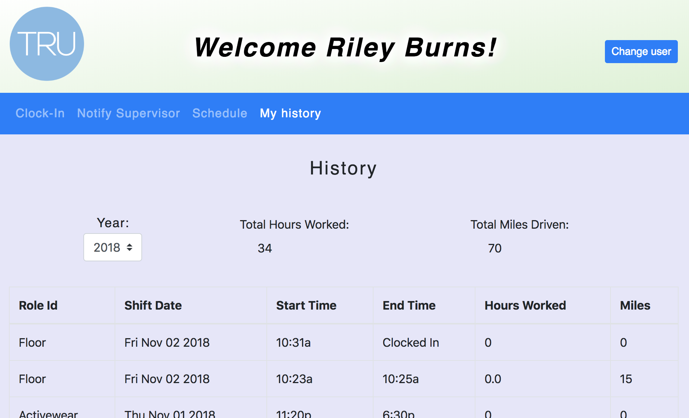
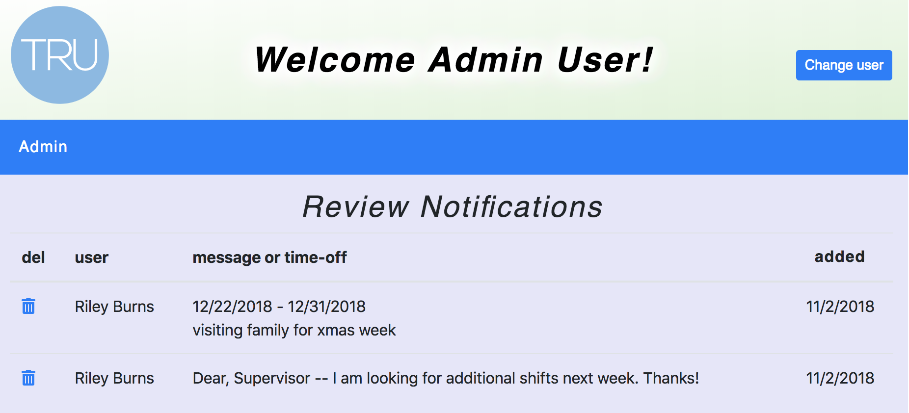

# VolClock -- Volunteer Time /clock

VolClock is used by volunteer organizations as a time clock allowing volunteers
to clock in and out of their shifts, review their schedule, and message the
supervisor. The application records volunteers' time and number of miles driven
for each shift.  The application is designed to be as simple as possible to
meet the needs of a community with a range of computer experience and comfort.

***
# Login Page

Volunteers login with a four digit code, which may be the last four digits of
their phone number (examples 0000, 1234).  Supervisor can log in with a special code (9999)

***
# Clock In / Out Page

The user is presented buttons for the roles they typically perform, as designated
by the supervisor.  Clicking a button clocks the volunteer in for that role.  A
selection list at the bottom of the page lists allows the volunteer to clock
into any role.  

The first time the volunteer clocks in for the day they may enter the miles
driven to/from the volunteer location for deduction from their taxes.  
Subsequent
logins for the day

When clocked in this page display a single, large red button the user clicks
to clock out.  If a user forgets to clock out the system will automatically
clock them out at with a system-designated end time.

***
# Notify Supervisor Page

The volunteer can choose to:

* send a message the supervisor  
* enter dates and a note for vacation or other time off
* review and delete messages and time off requests

***
# Schedule Page

Shows the days, times, and roles the volunteer has volunteered to perform
each week.

***
# History Page

Shows the volunteer's history of volunteer service.  A selection list allows
the volunteer to choose which year to view.  Totals appear at the top for
the chosen year.

***
# Admin Page

When the supervisor logs in (9999) they are presented with a list of all messages
and time off notifications from the volunteers.

